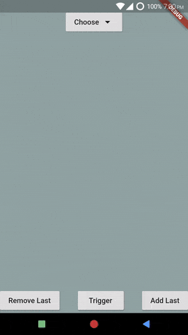
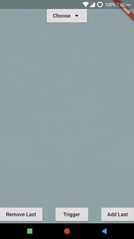

# SelectionMenuController: Updating List Dynamically
*Example: 1_basic_08*

There are two ways you can achieve dynamically updating SelectionMenu's
itemsList.

> itemsList property of SelectionMenu is the reference of the actual list.
> Any change in the actual list will be reflected in SelectionMenu,
> however, this change might not appear immediately. The below provided 
> solutions work.

## Method 1
Using SelectionMenuController.notifyListUpdated

### Code Highlights

```dart
import 'package:selection_menu/selection_menu.dart';

// Defining the controller
final SelectionMenuController selectionMenuController = SelectionMenuController();

SelectionMenu<FlatColor>(
  // Assigning the controller
  selectionMenuController: selectionMenuController,
  itemsList: colors,
  // ...
);

// Update the list (The same that was assigned to SelectionMenu)
// SelectionMenu stores a reference to the actual list.

colors.add(FlatColor(...));

// Trigger the SelectionMenu
selectionMenuController.trigger();

// Notify SelectionMenu menu that itemsList has been changed.
// This will only rebuild the MenuComponent.
selectionMenuController.notifyListUpdated();
```

For complete code, see [method_1.dart](./method_1.dart).
### Result



[API Docs: SelectionMenu](https://pub.dev/documentation/selection_menu/latest/selection_menu/SelectionMenu-class.html)

## Method 2
By wrapping SelectionMenu in a StatefulWidget and using setState.

### Code Highlights

```dart
import 'package:selection_menu/selection_menu.dart';

class MyStatefulWidget extends StatefulWidget {
  @override
  _MyStatefulWidgetState createState() => _MyStatefulWidgetState();
}

class _MyStatefulWidgetState extends State<MyStatefulWidget> {
  @override
  Widget build(BuildContext context) {
    return SelectionMenu<FlatColor>(
      selectionMenuController: selectionMenuController,
      itemsList: colors,
      // ...
    );
  }
  
  void updateList()
  {
    setState((){
      colors.add(FlatColor(...));
    });
  }
}
```
For complete code, see [method_2.dart](./method_2.dart).
### Result



[API Docs: SelectionMenu](https://pub.dev/documentation/selection_menu/latest/selection_menu/SelectionMenu-class.html)

# Which is Better?

Method 1 is better because

  * Only the MenuComponent is rebuilt.
  * Method 2 doesn't update list immediately if the menu is currently
    showing a filtered set of items.
    
